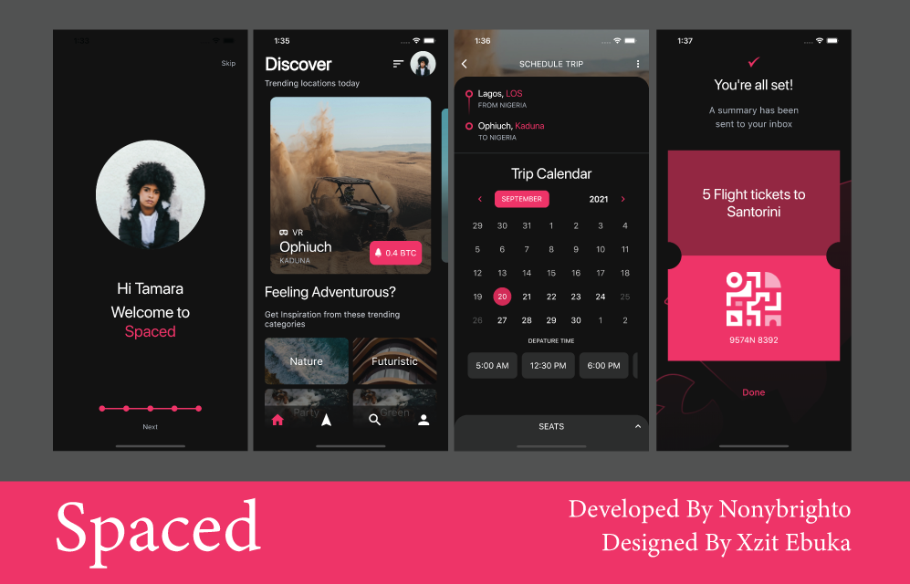
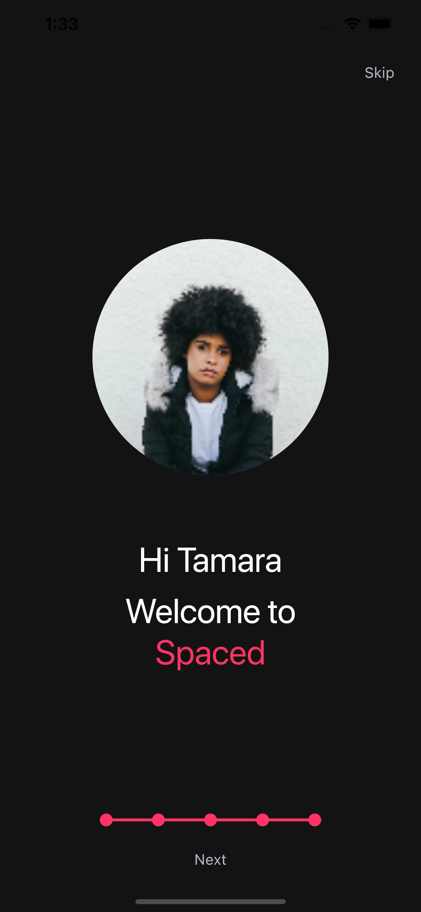
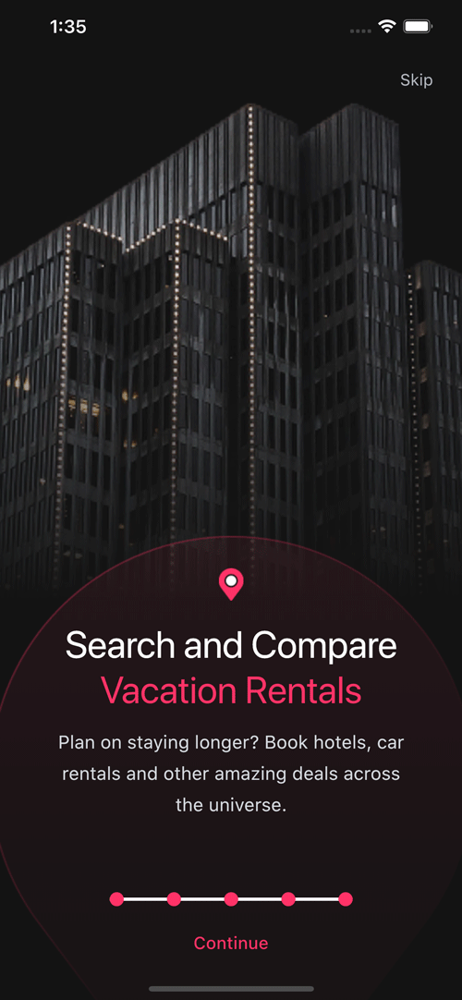
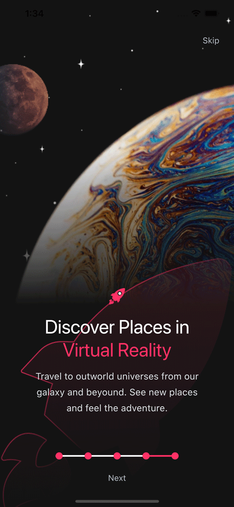
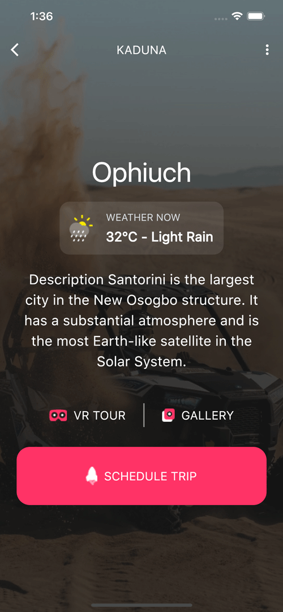
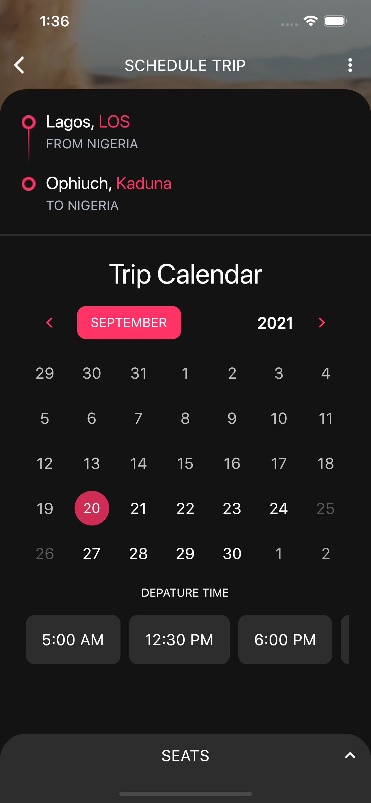
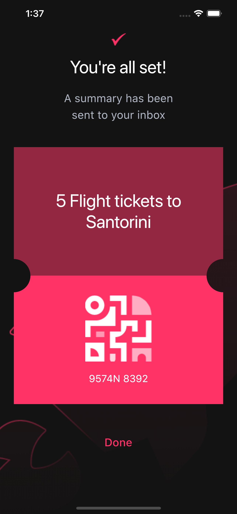

# spaced_trip_scheduler

Spaced is an animated trip scheduling application UI that enables users to surf for locations to travel to within and outside earth :-).  It is based on an amazing UI by [Xzit Ebuka](https://projects.invisionapp.com/prototype/Spaced-ckoya27rk005bem01178r0com/play/b74b1846?fbclid=IwAR1QN5VBFbGq5CpC4ruQv-wN36TO5ot9v36B2znp-XcmRQduXSsjFVrrR9I), and developed by nonybrighto.

## Overview

## [Watch it on YouTube](https://youtu.be/S52E9KM7hYw)

## Animation

## Screenshots

Screenshots from the developed flutter application

| Welcome                                 | Vacation                                 | Discovery                                 |
| --------------------------------------------- | --------------------------------------------- | --------------------------------------------- |
|  |  |  |
| Home                                 | Search                                | Profile                                 |
|  |  |  |
| Location                                | Date                                | Success                                |
|  |  |  |

## Mentions

The UI is designed by Xzit Ebuka. located [here](https://projects.invisionapp.com/prototype/Spaced-ckoya27rk005bem01178r0com/play/b74b1846?fbclid=IwAR1QN5VBFbGq5CpC4ruQv-wN36TO5ot9v36B2znp-XcmRQduXSsjFVrrR9I)

To learn how to make complex flutter animations, watch [Implementing complex UI with Flutter - Marcin Szałek | Flutter Europe](https://www.youtube.com/watch?v=FCyoHclCqc8&t=672s)
